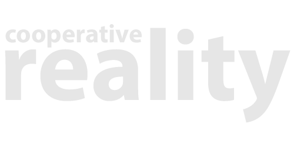

  

## Requirements

Unity version 2019.4 LTS or greater

This project was built on the 2019.4 LTS, if you want to ensure 100% compatability, use that one.

MRTK version 2.7.2 +

Download and import all the packages from the [latest realease of MRTK](https://github.com/microsoft/MixedRealityToolkit-Unity/releases)

Vuforia 9.8.8 +

Download and import the [latest version of vuforia for unity](https://developer.vuforia.com/downloads/SDK)

Photon 2

Download and add the [PUN 2 - Free asset from the asset store](https://assetstore.unity.com/packages/tools/network/pun-2-free-119922)

# Setup

### Install MRTK + Vuforia + Photon

[MRTK + Vuforia Tutorial](https://library.vuforia.com/articles/Solution/Working-with-the-HoloLens-sample-in-Unity.html)

## Setting up HoloAvatar rigged hands

TBD

## Example Scenes

### 1 Networked Object

### 2 Hololens Avatars

### 3 Desktop and Hololens

Demonstrates a multi-scene project that lets desktop and hololens builds communicate with eachother. Put all three scenes in the build output, the first scene `Startup` will automatically detect the target platform and load the Hololens or Desktop scene accordingly. Desktop users can use the middle mouse button to rotate the scene.

## Modules

### Network Module

Module for connecting / disconnecting from the photon server.

### Avatar Module

Module for creating user avatars and syncronizing them between all users.

# Disclaimer

